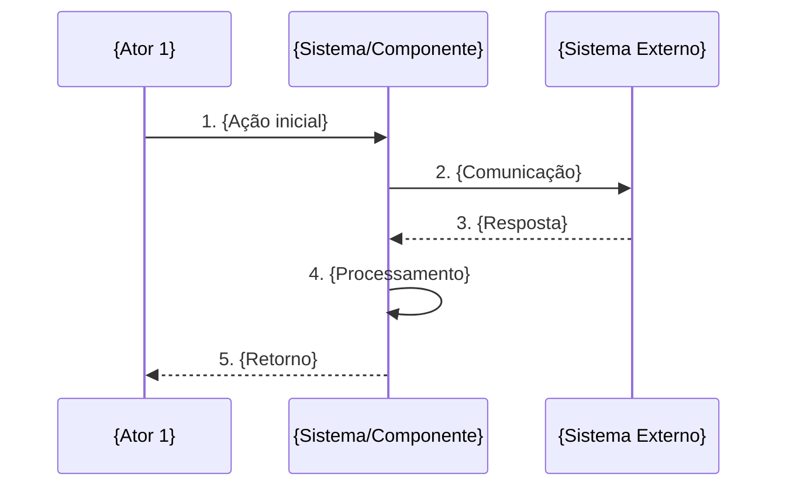

# Criar Caso de Uso

Crie um documento de caso de uso completo seguindo o template e padrões definidos abaixo.

## Argumentos

$ARGUMENTS

## Instruções

Analise o argumento fornecido. Ele pode ser:
1. **Item de tarefa**: Uma descrição de funcionalidade/requisito (ex: "Sincronizar clientes do sistema A para o B")
2. **Documento de base**: Um arquivo existente com especificações para detalhar

### Passos para criação:

1. **Identifique o domínio** do caso de uso com base no contexto:
   - AUTH: Autenticação e autorização de usuários
   - LEAD: Gestão de leads (CRUD, atribuição, status)
   - CONV: Captura e análise de conversas WhatsApp
   - SCORE: Sistema de pontuação e classificação de leads
   - IA: Análise com IA (GPT-4, sentiment analysis, sugestões)
   - DASH: Dashboard web para gestores
   - EXT: Extensão Chrome (copiloto do vendedor)
   - WS: WebSocket e comunicação real-time
   - ANL: Analytics e métricas (conversão, performance)
   - NOTIF: Notificações e alertas
   - INT: Integrações externas (Twilio, CRMs)
   - Outro domínio conforme o contexto do projeto

2. **Determine o próximo ID** disponível seguindo o padrão `UC-{DOMINIO}-{NUMERO}` onde:
   - DOMINIO = sigla de 3-4 letras identificando a área
   - NUMERO = número sequencial de 3 dígitos (001, 002, etc.)
   - Se existirem casos de uso no projeto, verifique os IDs existentes

3. **Crie o documento** seguindo o template abaixo

## Template de Caso de Uso

```markdown
# UC-{ID}: {Nome do Caso de Uso}

## Informações Gerais

| Campo          | Valor                                    |
|----------------|------------------------------------------|
| **ID**         | UC-{ID}                                  |
| **Nome**       | {Nome descritivo}                        |
| **Domínio**    | {Nome do domínio}                        |
| **Prioridade** | {Alta/Média/Baixa}                       |
| **Versão**     | 1.0                                      |
| **Status**     | Rascunho                                 |

---

## 1. Descrição

{Descrição clara e concisa do que o caso de uso faz, seu propósito e contexto de negócio. 2-3 parágrafos.}

---

## 2. Atores

| Ator                  | Tipo     | Descrição                                          |
|-----------------------|----------|----------------------------------------------------|
| {Ator Principal}      | Primário | {Descrição do papel}                               |
| {Ator Secundário}     | Sistema  | {Descrição do papel}                               |

---

## 3. Pré-condições

1. {Pré-condição 1}
2. {Pré-condição 2}
3. {Pré-condição N}

---

## 4. Pós-condições

### Sucesso
- {Resultado esperado 1}
- {Resultado esperado 2}
- Log de operação registrado

### Falha
- Log de erro registrado com detalhes
- {Ação de recuperação}
- Notificação enviada se erro crítico

---

## 5. Fluxo Principal



### Passos Detalhados

| Passo | Ação                                                                |
|-------|---------------------------------------------------------------------|
| 1     | {Descrição detalhada do passo 1}                                    |
| 2     | {Descrição detalhada do passo 2}                                    |
| N     | {Descrição detalhada do passo N}                                    |

---

## 6. Fluxos Alternativos

### FA1: {Nome do fluxo alternativo 1}

| Passo | Condição                        | Ação                                    |
|-------|---------------------------------|-----------------------------------------|
| Xa    | {Condição de desvio}            | {Ação alternativa}                      |
| Xb    | -                               | {Continuação}                           |

### FA2: {Nome do fluxo alternativo 2}

| Passo | Condição                        | Ação                                    |
|-------|---------------------------------|-----------------------------------------|
| Ya    | {Condição de desvio}            | {Ação alternativa}                      |
| Yb    | -                               | {Continuação}                           |

---

## 7. Exceções

| Código | Exceção                         | Tratamento                           |
|--------|---------------------------------|--------------------------------------|
| E001   | {Tipo de exceção}               | {Como tratar}                        |
| E002   | {Tipo de exceção}               | {Como tratar}                        |
| E003   | Timeout na comunicação          | Retry com backoff exponencial        |

---

## 8. Regras de Negócio

| ID   | Regra                                                                              |
|------|------------------------------------------------------------------------------------|
| RN01 | {Regra de negócio 1}                                                               |
| RN02 | {Regra de negócio 2}                                                               |
| RN03 | {Regra de negócio N}                                                               |

### Detalhamento RN{X} - {Nome da regra complexa}

{Se alguma regra precisar de detalhamento adicional, incluir aqui com:}
- Descrição expandida
- Tabela de valores permitidos
- Pseudocódigo se necessário
- Diagramas de decisão (mermaid flowchart)

---

## 9. Requisitos Não-Funcionais

| ID    | Requisito                                                     |
|-------|---------------------------------------------------------------|
| RNF01 | {Performance: tempo de resposta, throughput}                  |
| RNF02 | {Disponibilidade/SLA}                                         |
| RNF03 | {Retry e resiliência}                                         |
| RNF04 | {Logging e auditoria}                                         |

---

## 10. Dados Técnicos

### Mapeamento de Campos: {Origem} → {Destino}

| Campo Origem    | Campo Destino    | Tipo          | Obrigatório | Observação           |
|-----------------|------------------|---------------|-------------|----------------------|
| {campo1}        | {CAMPO1}         | VARCHAR(100)  | Sim         | {Nota}               |
| {campo2}        | {CAMPO2}         | INT           | Não         | {Nota}               |

### Endpoint {Sistema} - {Operação}

```http
{METHOD} {URL}
Authorization: Bearer {token}
Content-Type: application/json
```

### Request Body

```json
{
  "campo1": "valor",
  "campo2": 123
}
```

### Response (Sucesso)

```json
{
  "status": "success",
  "data": {}
}
```

### Response (Erro)

```json
{
  "status": "error",
  "code": "ERROR_CODE",
  "message": "Descrição do erro"
}
```

---

## 11. Estrutura de Dados

{Se houver modelo de dados específico, incluir aqui:}

```json
{
  "id": "string",
  "campo": "valor"
}
```

Ou schema SQL:

```sql
CREATE TABLE {NomeTabela} (
    Id INT PRIMARY KEY,
    Campo VARCHAR(100)
);
```

---

## 12. Casos de Teste

| ID   | Cenário                              | Entrada                           | Resultado Esperado               |
|------|--------------------------------------|-----------------------------------|----------------------------------|
| CT01 | {Cenário de sucesso básico}          | {Dados válidos}                   | {Resultado esperado}             |
| CT02 | {Cenário alternativo}                | {Dados variação}                  | {Resultado esperado}             |
| CT03 | {Cenário de erro}                    | {Dados inválidos}                 | {Erro esperado}                  |
| CT04 | {Cenário de borda}                   | {Dados limite}                    | {Comportamento esperado}         |

---

## 13. Métricas e Monitoramento

| Métrica                      | Descrição                                |
|------------------------------|------------------------------------------|
| {operacao}_total             | Total de operações realizadas            |
| {operacao}_duration          | Duração média da operação                |
| {operacao}_errors            | Erros durante operação                   |
| {operacao}_success_rate      | Taxa de sucesso                          |

---

## 14. Dependências

| Caso de Uso  | Relação      | Descrição                              |
|--------------|--------------|----------------------------------------|
| UC-{XX}-{N}  | Depende de   | {O que é necessário}                   |
| UC-{XX}-{N}  | Estende      | {O que é estendido}                    |
| UC-{XX}-{N}  | Inclui       | {O que é incluído}                     |
| UC-{XX}-{N}  | Usado por    | {Quem usa este UC}                     |

---

## 15. Referências

- [{Nome do documento}]({caminho relativo})
- [{Documentação externa}]({URL se aplicável})

---

*Criado em: {DATA ATUAL no formato YYYY-MM-DD}*
*Última atualização: {DATA ATUAL no formato YYYY-MM-DD}*
```

## Diretrizes de Qualidade

1. **Completude**: Preencha todas as seções relevantes. Remova seções que não se aplicam.

2. **Clareza**: Use linguagem clara e objetiva. Evite ambiguidades.

3. **Consistência**: Mantenha nomenclatura consistente ao longo do documento.

4. **Diagramas**: Use Mermaid para diagramas de sequência e fluxogramas.

5. **Exemplos**: Inclua payloads de request/response realistas.

6. **Testes**: Cubra cenários de sucesso, erro e edge cases.

7. **Mapeamento**: Documente transformações de dados quando houver integração.

## Saída Esperada

Gere o documento de caso de uso completo em Markdown, pronto para ser salvo no diretório de documentação do projeto.

Pergunte ao usuário:
1. Qual o diretório onde o arquivo deve ser salvo (ou sugira baseado no projeto)
2. Se há casos de uso existentes para verificar numeração
3. Se há detalhes específicos que devem ser incluídos

Após confirmação, crie o arquivo usando a ferramenta Write.
